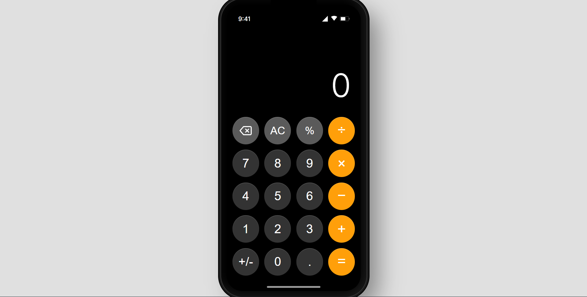

# iPhone Calculator Replica

This is a fully functional clone of the iPhone calculator, built with HTML, CSS, and JavaScript. It features a realistic UI, complete with animations, improved logic for sequential calculations, and responsive text sizing.

## Preview

## Features
- **Realistic Design**: Mimics the iOS calculator aesthetic with rounded buttons, shadows, and status bar.
- **Advanced Logic**: Supports chaining operations (e.g., `11 + 22 + 33`), storing history, and displaying the full equation.
- **Responsive Display**: Text wraps and scales for long numbers.
- **Dark Mode**: Built with the native dark theme colors.

## How to Run
Simply open `index.html` in your web browser.
